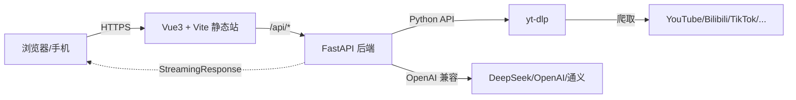
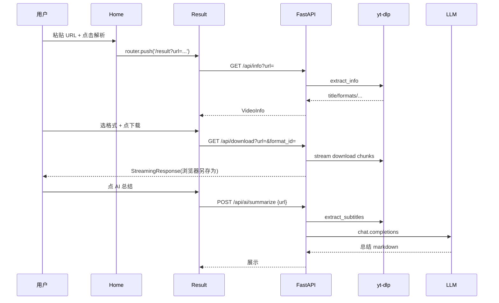

# 方案设计文档

> 万能视频下载站 · 阶段 3 技术方案

## 1. 总体架构



设计核心思想：**站在巨人的肩膀上**

- 视频解析与下载 100% 委托给 [yt-dlp](https://github.com/yt-dlp/yt-dlp)（19w star、覆盖 1000+ 平台、社区持续维护）
- LLM 走 OpenAI 兼容协议，环境变量任意切 DeepSeek / 通义 / OpenAI
- 无数据库、无文件落盘，全靠流式 + 一次性内存

## 2. 技术选型

| 层 | 选型 | 理由 |
|---|---|---|
| 后端 | FastAPI + uvicorn | 原生异步、自动文档、和 yt-dlp（Python）零成本集成 |
| 视频引擎 | yt-dlp（Python API 直接调用） | 不走 subprocess，避免拼参数和编码问题 |
| LLM | `openai>=1.0` SDK | 同一份代码兼容 OpenAI / DeepSeek / 通义千问等所有 OpenAI 风格端点 |
| 前端 | Vue 3 + Vite + TypeScript | 对标参考站点技术栈、生态好 |
| 样式 | Tailwind CSS + 自定义 CSS 变量 | 主题切换方便、卡片网格风格易实现 |
| 路由 / 请求 | vue-router + axios | 标准搭配 |
| 部署 | 本地 dev 启动；后续可 docker-compose | 单机即可跑 |

## 3. 目录结构

```text
video-downloader/
├── docs/                                # 需求/设计沉淀
│   ├── 01-requirements.md
│   ├── 02-design.md (本文)
│   ├── 03-ui-design-system.md
│   └── 04-api-spec.md
├── backend/
│   ├── main.py                          # FastAPI app + 路由挂载 + CORS
│   ├── config.py                        # 读 .env：OPENAI_API_KEY / BASE_URL / MODEL
│   ├── schemas.py                       # Pydantic 请求/响应模型
│   ├── routers/
│   │   ├── video.py                     # /api/info /download /batch /subtitles
│   │   └── ai.py                        # /api/ai/summarize /translate
│   ├── services/
│   │   ├── ytdlp_service.py             # 封装 extract_info / stream_download / extract_subtitles
│   │   └── llm_service.py               # OpenAI 兼容客户端 + 字幕切块 + prompt
│   ├── requirements.txt
│   └── .env.example
└── frontend/
    ├── index.html
    ├── package.json
    ├── vite.config.ts                   # /api -> http://127.0.0.1:8000 代理
    ├── tailwind.config.js
    ├── postcss.config.js
    └── src/
        ├── main.ts
        ├── router.ts                    # / /result /pricing
        ├── api.ts                       # axios 实例 + 统一错误处理
        ├── style.css                    # tailwind + CSS 变量（紫色渐变主题）
        ├── views/
        │   ├── Home.vue                 # Hero + 平台卡片网格 + 特性卡片 + CTA
        │   ├── Result.vue               # 视频信息 + FormatPicker + AI 操作面板
        │   └── Pricing.vue              # 三档定价（占位）
        └── components/
            ├── HeroInput.vue
            ├── PlatformCard.vue
            ├── FeatureCard.vue
            ├── FormatPicker.vue
            ├── AIPanel.vue              # 总结结果 / 翻译结果
            ├── NavBar.vue
            └── Footer.vue
```

## 4. 后端核心逻辑

### 4.1 yt-dlp 服务封装

```python
from yt_dlp import YoutubeDL

BASE_OPTS = {"quiet": True, "no_warnings": True, "noplaylist": False}

def extract_info(url: str) -> dict:
    with YoutubeDL({**BASE_OPTS, "skip_download": True}) as ydl:
        return ydl.sanitize_info(ydl.extract_info(url, download=False))

def stream_download(url: str, format_id: str):
    """生成器：yield 二进制块，由 FastAPI StreamingResponse 直推浏览器"""
    # 实现方式：YoutubeDL + progress_hooks 拿到直链 → httpx.stream 拉取 → yield chunks
    ...

def extract_subtitles(url: str, lang: str = "zh-Hans") -> str | None:
    opts = {**BASE_OPTS, "writesubtitles": True, "writeautomaticsub": True,
            "subtitleslangs": [lang, "zh", "en"], "skip_download": True}
    # 解析 info["subtitles"] / info["automatic_captions"]，按优先级取一份并下载内容返回 SRT 文本
```

### 4.2 LLM 服务封装

```python
from openai import OpenAI

def get_client():
    return OpenAI(api_key=settings.OPENAI_API_KEY, base_url=settings.OPENAI_BASE_URL)

def summarize(subtitle_srt: str) -> str:
    """切块 → 多轮 map-reduce 总结 → 输出中文要点 + 时间线"""

def translate_srt(srt: str, target_lang: str) -> str:
    """保留时间戳，仅翻译文本块；每 30~50 条字幕一批，保证不超 context"""
```

未配置 key 时返回 `503 LLM_NOT_CONFIGURED`，前端友好降级。

### 4.3 错误处理统一

- 422：URL 不合法 / 不支持平台
- 503：LLM 未配置 / 字幕不存在
- 500：yt-dlp 内部异常 → 透传简化版 message

## 5. 前端核心逻辑

### 5.1 路由

| 路径 | 视图 | 作用 |
|---|---|---|
| `/` | Home | Hero 输入 + 平台/特性卡片 + Pricing CTA |
| `/result?url=...` | Result | 解析结果 + 格式选择 + AI 操作 |
| `/pricing` | Pricing | 三档定价占位 |

### 5.2 数据流



### 5.3 批量下载

`Home` 输入框右下角"批量"按钮 → 弹窗多行文本框 → 点击解析 → 后端 `/api/batch` 并发返回 → `Result` 用列表渲染，每条独立的下载按钮。

## 6. 关键非功能实现

| 项 | 做法 |
|---|---|
| 下载不占盘 | yt-dlp 拿到直链 + httpx.stream → FastAPI StreamingResponse → 浏览器另存为 |
| 大文件 | 8KB 分块流式，前端展示进度（基于 Content-Length 估算） |
| 跨域 | dev 走 vite 代理；生产同源部署或后端开 CORS |
| 密钥安全 | LLM key 仅后端环境变量；前端永不接触 |
| 错误兜底 | axios 拦截器统一 toast；后端按 HTTP code 区分 |
| 移动端 | Tailwind 响应式断点；Hero 输入框堆叠；卡片网格 → 单列 |

## 7. 启动方式

```bash
# 后端
cd backend
python -m venv .venv && .venv\Scripts\activate
pip install -r requirements.txt
copy .env.example .env  # 填 OPENAI_API_KEY / BASE_URL / MODEL（可留空跳过 AI）
uvicorn main:app --reload --port 8000

# 前端
cd frontend
npm install
npm run dev  # 默认 5173
```

## 8. 自验清单

- [ ] YouTube 公开视频：解析 + 下载 1080p 成功
- [ ] Bilibili 公开视频：解析 + 下载 + 拿到中文字幕
- [ ] TikTok / 抖音视频：解析 + 下载无水印
- [ ] 批量 3 个 URL：并发返回各自 info，逐条下载成功
- [ ] 字幕导出 SRT 可在 VLC 加载
- [ ] AI 总结：配置 key 后返回结构化要点；不配置时友好提示
- [ ] 字幕翻译：英文 srt → 中文 srt，时间戳保留
- [ ] 移动端（浏览器模拟器 375x667）：Hero、卡片、Result 页面均可正常使用
