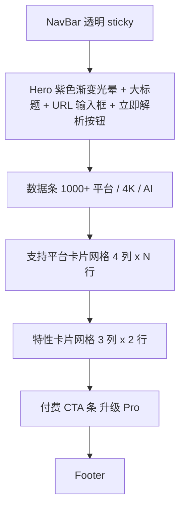

# UI 设计系统

> 对标 ai.codefather.cn/painting · 突出付费转化

## 1. 设计基调

| 维度 | 决策 | 依据（ui-ux-pro-max 数据） |
|---|---|---|
| Pattern | Hero-Centric + Feature-Rich + Conversion-Optimized | Digital Products/Downloads（行 83）+ Subscription Box（行 28） |
| Style | Vibrant & Block-based + 轻量 Glassmorphism + Motion-Driven（克制） | 同上 + 参考站点视觉 |
| Mood | 现代、可信、有付费冲动；不要陈旧、不要花哨 | 参考站点付费导航属性 |
| Mode | 默认浅色（与参考站一致） | 参考站 |

## 2. 配色

```css
:root {
  /* Brand */
  --color-primary: #7C3AED;        /* violet-600 主紫 */
  --color-primary-deep: #5B21B6;   /* violet-800 hover */
  --color-secondary: #A78BFA;      /* violet-400 浅紫 */
  --color-accent: #EC4899;         /* pink-500 渐变末端 */
  --color-cta: #F97316;            /* orange-500 付费 CTA */
  --color-cta-hover: #EA580C;

  /* Surface */
  --color-bg: #FAFAFB;             /* 页面底色 */
  --color-surface: #FFFFFF;        /* 卡片底色 */
  --color-surface-elevated: #FFFFFF;
  --color-border: #E2E8F0;         /* slate-200 */
  --color-border-strong: #CBD5E1;

  /* Text */
  --color-text: #0F172A;           /* slate-900 主文 */
  --color-text-muted: #475569;     /* slate-600 副文（务必 ≥ 4.5:1 对比） */
  --color-text-subtle: #94A3B8;    /* slate-400 占位 */

  /* Status */
  --color-success: #10B981;
  --color-warning: #F59E0B;
  --color-danger: #EF4444;

  /* Gradients */
  --gradient-hero: linear-gradient(135deg, #7C3AED 0%, #EC4899 100%);
  --gradient-glow: radial-gradient(60% 60% at 50% 0%, rgba(124, 58, 237, 0.25) 0%, transparent 80%);
}
```

对比度验证：`#475569` on `#FAFAFB` ≈ 8.6:1 ✅；`#0F172A` on `#FAFAFB` ≈ 17.6:1 ✅

## 3. 字体

主字体：**Plus Jakarta Sans**（现代 SaaS 友好）+ **Noto Sans SC**（中文兜底）

```css
font-family: "Plus Jakarta Sans", "Noto Sans SC", -apple-system, BlinkMacSystemFont, "Segoe UI", sans-serif;
```

字号阶梯（rem）：

| Token | 值 | 用途 |
|---|---|---|
| `text-xs` | 0.75 | 标签、辅助说明 |
| `text-sm` | 0.875 | 副文 |
| `text-base` | 1.0 | 正文 |
| `text-lg` | 1.125 | 卡片标题 |
| `text-2xl` | 1.5 | 区段标题 |
| `text-4xl` | 2.25 | Hero 副标题 |
| `text-6xl` | 3.75 | Hero 大标题 |

字重：400 / 500 / 600 / 700。

## 4. 间距与圆角

- 间距：4 / 8 / 12 / 16 / 24 / 32 / 48 / 64 / 96（Tailwind `1 2 3 4 6 8 12 16 24`）
- 圆角：卡片 `rounded-2xl`(16px)、按钮 `rounded-xl`(12px)、Pill `rounded-full`
- 阴影：
  - 基础卡片 `shadow-[0_4px_24px_-12px_rgba(15,23,42,0.08)]`
  - hover 抬起 `shadow-[0_12px_40px_-12px_rgba(124,58,237,0.25)]`
  - CTA 按钮发光 `shadow-[0_8px_32px_-8px_rgba(249,115,22,0.5)]`

## 5. 动效

| 元素 | 动效 | 时长 |
|---|---|---|
| 卡片 hover | 轻微上浮 `-translate-y-1` + 阴影变深，**不缩放**（防止布局抖动） | 200ms |
| 按钮 hover | 颜色加深 + 阴影发光 | 150ms |
| Hero 渐变光晕 | 缓慢呼吸 6s ease-in-out infinite | 6s |
| 页面切换 | fade + 微下移 8px | 250ms |
| 移动端：尊重 `prefers-reduced-motion`，禁用呼吸动画 |

## 6. 页面结构

### 6.1 Home（落地页）



**Hero 关键元素：**
- 顶部 60% 高度紫色径向光晕 `--gradient-glow`
- 主标题：`万能视频下载，一键搞定`（text-6xl, 700, 中间渐变文字）
- 副标题：`粘贴链接即可下载 1000+ 平台视频 · 高清无水印 · AI 字幕翻译`
- 大输入框（h-16, 圆角 2xl, 阴影），右侧 CTA 按钮 `立即解析`（橙色渐变 + 发光阴影）
- 输入框下方一行 chips：`YouTube` `Bilibili` `TikTok` `抖音` `X` `Instagram` `批量下载`

**平台卡片（PlatformCard）：**
- 16:9 上下结构，顶部 logo + 圆角配色块（每平台主色，如 YouTube #FF0000，Bilibili #00A1D6），底部白底标题 + 标签
- 标签：`下载` `字幕` `合集`
- hover 上浮 + 阴影

**特性卡片（FeatureCard）：**
- 6 张：批量下载 / 4K 8K 高清 / 1000+ 平台 / AI 视频总结 / AI 字幕翻译 / 移动端可用
- AI 两张挂 `Pro` 角标（橙渐变 pill）

### 6.2 Result（解析结果）

```text
┌──────────────────────────────────────────────────────┐
│ ◀ 返回                                                │
│ ┌──────────┐  视频标题（text-2xl 700）                 │
│ │  缩略图   │  作者 · 时长 · 平台徽章                    │
│ │          │  描述（最多 3 行）                         │
│ └──────────┘                                          │
│                                                       │
│ ┌─ 下载选项 ───────────┐  ┌─ AI 工具 ─────────────┐    │
│ │ • 1080p MP4 80MB ⬇  │  │ [AI 总结] [字幕翻译]   │    │
│ │ • 720p  MP4 45MB ⬇  │  │ 输出区（markdown 渲染） │    │
│ │ • 仅音频 m4a 5MB ⬇  │  │                        │    │
│ │ • 字幕 SRT  zh ⬇   │  │                        │    │
│ └─────────────────────┘  └────────────────────────┘    │
└──────────────────────────────────────────────────────┘
```

**FormatPicker：**
- 列表行：清晰度徽章 + 编码 + 文件大小 + 下载按钮
- 推荐项：左侧加金色「推荐」竖条
- 仅音频：单独分组

**AIPanel：**
- 两个 Tab：`视频总结` / `字幕翻译`
- 总结：要点 bullet + 时间戳（HH:MM）可点跳转
- 翻译：原文 / 译文左右对照 + 下载译版 SRT 按钮
- 未配置 key 时灰显 + 提示

### 6.3 Pricing（占位）

三档卡片：`免费` / `Pro 月度 ¥29` / `Pro 年度 ¥199`（中间卡 `推荐` 高亮，紫色边框 + 角标）。所有按钮点击 → toast「即将上线」。

## 7. 组件清单（一次到位）

| 组件 | 文件 | 关键样式 |
|---|---|---|
| NavBar | `components/NavBar.vue` | sticky 半透明 + backdrop-blur，logo + 导航 + 升级 Pro CTA |
| HeroInput | `components/HeroInput.vue` | 大输入框 + 渐变按钮 + 平台 chips |
| PlatformCard | `components/PlatformCard.vue` | 平台主色块顶 + 白底 + 标签 |
| FeatureCard | `components/FeatureCard.vue` | 图标 + 标题 + 描述 + 可选 Pro 角标 |
| FormatPicker | `components/FormatPicker.vue` | 列表 + 推荐徽章 + 下载按钮 |
| AIPanel | `components/AIPanel.vue` | Tab + markdown 渲染 + loading 骨架屏 |
| Footer | `components/Footer.vue` | 版权 + 法律声明（仅供个人合法使用） |

## 8. Pre-Delivery 检查（强制）

- [ ] 全部图标用 SVG（Lucide / Heroicons），**禁止 emoji 作为 UI 图标**
- [ ] 所有可点击元素 `cursor-pointer`
- [ ] hover 不引起布局抖动（不用 scale 移动元素，用 translateY + shadow）
- [ ] 副文颜色 ≥ `slate-600`（`#475569`），不用 slate-400 当正文
- [ ] 边框可见：浅色模式用 `border-slate-200`，不要 `border-white/10`
- [ ] 浮动导航：`top-4 left-4 right-4` 留边距，内容区给足 padding-top
- [ ] 响应式断点过：375 / 768 / 1024 / 1440
- [ ] `prefers-reduced-motion` 时禁用呼吸动画
- [ ] 所有图片有 `alt`，输入框有可见 label 或 aria-label

## 9. 反模式（必须避免）

| ❌ Don't | ✅ Do |
|---|---|
| emoji 当图标 🚀 | Lucide SVG |
| 卡片 hover scale 1.05 撑开布局 | translateY(-4px) + shadow |
| Hero 紫粉渐变铺满整屏 | 顶部 60% 径向光晕 + 浅底 |
| 副文 slate-400 看不清 | slate-600 起 |
| 按钮无 cursor-pointer | 全部加 |
| Glass 卡 bg-white/10 | bg-white/80 起或纯白 |
